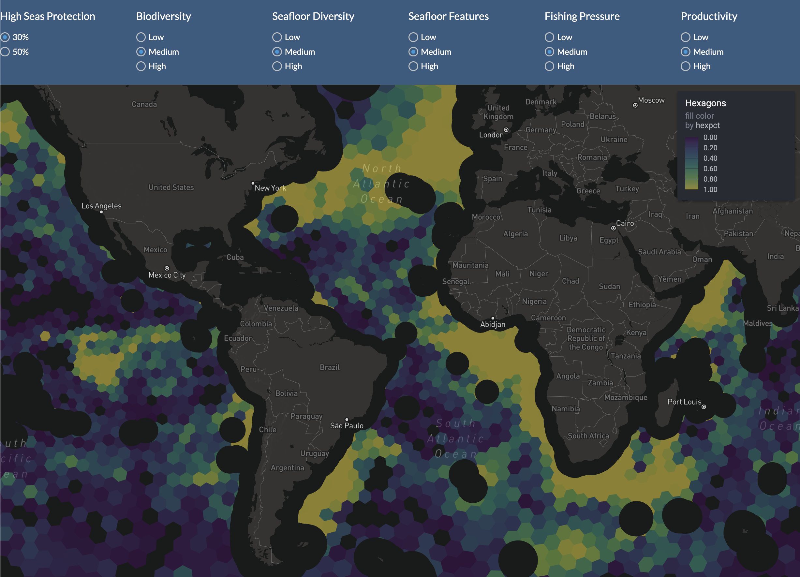

```{r setup, include=FALSE}
knitr::opts_chunk$set(echo = TRUE, warning = FALSE, message = FALSE)
```

This script prepares, solves and aggregates the conservation solutions for the BBNJ app.

## Prepare H3 hexagonal planning units

We'll take advantage of Uber's [H3](https://www.uber.com/blog/h3) hexagonal hierarchical spatial index using the R package [`h3`](https://crazycapivara.github.io/h3-r/articles/h3.html) with the following points:

- Include areas beyond national jurisdiction (ABNJ) with  [`bbnj::p_abnj`](https://benioffoceaninitiative.github.io/bbnj/reference/p_abnj.html). 

- Use [`h3::polyfill()`](https://crazycapivara.github.io/h3-r/reference/polyfill.html)
  to get all hexagons with centers contained in a given polygon.
  
- Use [`h3::h3_set_to_multi_polygon()`](https://crazycapivara.github.io/h3-r/reference/h3_set_to_multi_polygon.html) to create a (multi) polygon describing the outline(s) of a set of hexagons.

* [Gurobi installation guide • prioritizr](https://prioritizr.net/articles/gurobi_installation_guide.html)

```r
install.packages("/Library/gurobi952/macos_universal2/R/gurobi_9.5-2_R_4.2.0.tgz", repos=NULL)
```

```{r libraries}
# install library from Github source if missing
if (!require("h3")){
  remotes::install_github("crazycapivara/h3-r")
}
# load libraries, installing if missing
librarian::shelf(
  # custom BBNJ R library at https://github.com/BenioffOceanInitiative/bbnj
  BenioffOceanInitiative/bbnj, 
  # other libraries
  dplyr, DT,
  exactextractr, fs, ggplot2, glue, h3, here, mapview, 
  prioritizr, # prioritization library
  purrr, raster, readr, rgdal, rlang, scales, sf, slam, stringr, 
  terra, tibble,  tidyr, units)
source(here("libs/functions.R"))   # define custom functions
select  <- dplyr::select           # override raster::select()
rescale <- scales::rescale         # override terra::rescale()
options(readr.show_col_types = F)  # less output reading CSVs
mapviewOptions(fgb = F)
mapviewOptions(
  vector.palette = mapviewPalette("mapviewSpectralColors"))

# Google Drive on local machine (CHANGE THIS TO ANY LOCAL FOLDER)
dir_gdata <- "/Users/bbest/My Drive/projects/bbnj-app/data"
```

### make `hex_sf` for `abnj` at different resolutions

Make the hexagons for 4 resolutions. Show map of the coarsest resolution.

```{r, eval=F}
# get polygons for ABNJ (outside EEZ)
abnj <- bbnj::p_abnj %>% 
 st_set_crs(4326) # set to geographic projection
 # st_wrap_dateline()

# make_hex_res(1)
sapply(1:4, make_hex_res)

hex1 <- get_hex(1)
mapview(hex1)
```

```{r}
hex_smry_csv <- here("data/abnj_hex_res_summary.csv")

if (!file.exists(hex_smry_csv)){
  d <- tibble(
    hex_res = 1:4) %>% 
    mutate(
      h            = map(hex_res, function(r){
        # r <- 1
        g <- glue(here("data/abnj_hex_res{r}.geojson"))
        message(glue("reading {basename(g)}"))
        h <- read_sf(g) # mapview(h)
        h }),
      n_pu         = map_dbl(h, nrow),
      avg_area_km2 = map_dbl(h, function(h){
        # h <- d0$h[[3]]
        h %>% 
          mutate(geometry = st_make_valid(geometry)) %>% 
          filter(st_is_valid(geometry)) %>%
          pull(geometry) %>% 
          st_area() %>%
          set_units(km^2) %>% 
          mean()  }),
      avg_width_km = map_dbl(avg_area_km2, sqrt))
  d %>% 
    select(-h) %>% 
    write_csv(hex_smry_csv)
}

d_hex_smry <- read_csv(hex_smry_csv)
datatable(d_hex_smry, caption="Summary of hierarchical hexaganal planning units at finest (4) to be used for prioritization up to coarsest (1) for aggregating to show on maps at larger scales.")
```

## Gather Conservation Targets

### Create 7 Layers

Start with the output layers from the previous analysis in [bbnj-scripts]( https://github.com/BenioffOceanInitiative/bbnj-scripts).

```{r lyrs7}
lyrs7_grd <- here("data/lyrs7_mol.grd")
lyrs_sppidx <- 3:48

if (!file.exists(lyrs7_grd)){
  tifs1 <- list.files(here("../bbnj-scripts/map_layers"), "tif$", full.names = T)
  tifs2 <- list.files(here("../bbnj-scripts/presentation_maps"), "tif$", full.names = T)[-1] # drop redundant bio_vgpm.tif
  lyrs <- stack(c(tifs1, tifs2))
  sort(names(lyrs))
  
  
  s_nspp <- subset(lyrs, sort(names(lyrs))[lyrs_sppidx]) # nspp_2100_* + nspp_*
  r_nspp <- calc(s_nspp, sum, na.rm = T)
  
  s_mounts <- subset(lyrs, sort(names(lyrs))[49:51])
  r_mounts <- calc(s_mounts, sum, na.rm = T)
  
  r_vents <- raster(lyrs, layer = "phys_vents")
  r_scapes <- raster(lyrs, layer = "scapes_hetero")
  
  r_vgpm <- raster(lyrs, layer = "bio_vgpm")
  r_rls  <- raster(lyrs, layer = "rls_all")
  r_fishing <- raster(lyrs, layer = "fishing_KWH")
  
  # TODO: consider log/log10/normalize transforms of nspp, fish effort 
  #plot(r_vgpm)
  s_lyrs <- stack(
    r_fishing,
    r_vgpm,
    r_nspp,
    r_rls,
    r_vents,
    r_mounts,
    r_scapes)
  names(s_lyrs) <- c(
    "fishing",
    "vgpm",
    "nspp",
    "rls",
    "vents",
    "mounts",
    "scapes")
  terra::writeRaster(s_lyrs, lyrs7_grd)
}
s_lyrs7 <- terra::rast(lyrs7_grd)
names(s_lyrs7)
terra::plot(s_lyrs7)
```

### Extract 5 layers to planning units

```{r extract & threshold}
# use hex resolution 4 for planning units
hex_res = 4
pu <- get_hex(hex_res)

f5_csv <- here("data/pu_hex4_features5.csv")

if (!file.exists(f5_csv)){

  # extract feature values
  f_0 <- exact_extract(
    s_lyrs7, pu, fun = "mean", append_cols = "hexid", progress = F) %>% 
    tibble() %>% 
    rename_with(~str_replace(., "mean.", ""), everything())
  
  # extra feature calculations
  f_1 <- f_0 %>% 
    mutate(
      fishing = 1/fishing,            # TODO: log(1/fishing)? 
      spp     = rls * nspp,
      benthic = vents + mounts) %>%   # TODO: rescale(vents) + rescale(mounts)? 
    mutate(
      across(where(is.numeric), ~replace_na(., 0)))
  
  # rescale features
  f <- f_1 %>% 
    mutate(
      across(where(is.numeric), rescale))
  write_csv(f, f5_csv)
}
f <- read_csv(f5_csv)
f %>% 
  select(fishing, vgpm, scapes, spp, benthic) %>% 
  summary()

# join planning units with features
pu_f <- pu %>%               # 129,906 × 8
  left_join(f, by = "hexid") # 129,906 × 10
```

## Generate Prioritization Solutions

### Scenario parameters and weights

Area is either:

- 30% `0.3` or 
- 50% `0.5`

and the rest of the features are either:

- low `0.1`,
- medium `1.0` or 
- high `10`

```{r}
wts <- c(0.1, 1, 10)
s_configs <- expand_grid(
  area    = c(0.3, 0.5),
  benthic = wts,
  fishing = wts,
  scapes  = wts,
  spp     = wts,
  vgpm    = wts)

s_configs %>% 
  datatable()
```

### Solve for Scenarios

```{r, eval=T}
# set eval = TRUE to run remaining R chunks and generate outputs
# set eval = FALSE for quickly rendering *.Rmd to *.html
knitr::opts_chunk$set(eval = FALSE)
```

Cumulative sum plots of layers for determining target per layer and allowing weights to have differential impact on scenario solution.

#### hex anti-meridian issues

TODO: investigate geometry repair over sf::`st_make_valid()` with `wdpar::st_repair_geometry()`, especially for dateline issues:

* [Clean data — wdpa_clean • wdpar](https://prioritizr.github.io/wdpar/reference/wdpa_clean.html)
* [Repair geometry — st_repair_geometry • wdpar](https://prioritizr.github.io/wdpar/reference/st_repair_geometry.html)

#### plots of max feature


Generate all combinations of scenario parameters


```{r}
# get max value per layer, a la carrying capacity (K)
k_p <- sapply(
  c("fishing", "benthic", "scapes", "vgpm", "spp"),
  function(var){
    get_pu_v_ks(pu_f, !!sym(var), c(0.3, 0.5))
  }, 
  simplify = F)
k <- map(k_p, "k") %>% 
  bind_rows() %>% 
  select(-km2) %>% 
  rename(pct_area = k)
datatable(k) %>% 
  formatPercentage(c("pct_area", "pct_val"), 1)
# plots of max possible values with incremental ocean area
p <- map(k_p, "p") # get plots
# walk(p, print)
# print(p)
# print(p$fishing)


t0 <- Sys.time()
# source(here("libs/functions.R"))
s_lst <- s_configs %>% 
  pmap(get_scenario) 
Sys.time() - t0
# ~39 minutes to generate fresh on Ben's 2018 MacBook Pro
# ~15 minutes to generate fresh on Ben's 2022 MacBook Air M2

S <- tibble(
  s = s_lst) %>% 
  rowid_to_column("sid") %>% 
  mutate(
    scenario = map(s, function(s){
      tibble(area = s$area_pct) %>% 
        cbind(
          enframe(s$weights) %>% pivot_wider()) }),
    hexres   = hex_res,
    hexpct   = 1,
    hexid    = map(s, "hexids"),
    coverage = map(s, "coverage"))

s_params <- S %>% 
  select(sid, scenario) %>% 
  unnest(scenario)
write_csv(s_params, glue("{dir_gdata}/solution_params.csv"))
write_csv(s_params, here(glue("data/solution_params.csv")))

S %>% 
  select(sid, hexres, hexid, hexpct) %>% 
  unnest(hexid) %>% 
  write_csv(glue("{dir_gdata}/solution_hexids_res{hex_res}.csv"))

S %>% 
  select(sid, coverage) %>% 
  unnest(coverage) %>% 
  write_csv(glue("{dir_gdata}/solution_coverage.csv"))
```

### Write 10 examples for Github

```{r}
# write 10 examples for showing in Github
set.seed(42)
sid10 <- sample(S$sid, 10)
S10 <- S %>% 
  filter(sid %in% sid10)

S10 %>% 
  select(sid, scenario) %>% 
  unnest(scenario) %>% 
  write_csv(here(glue("data/sample10/solution_params.csv")))

S10 %>% 
  select(sid, hexres, hexid, hexpct) %>% 
  unnest(hexid) %>% 
  write_csv(here(glue("data/sample10/solution_hexids_res{hex_res}.csv")))

S10 %>% 
  select(sid, coverage) %>% 
  unnest(coverage) %>% 
  write_csv(here("data/sample10/solution_coverage.csv"))
```

## Aggregate to coarser hexagons and calculate percent contained

```{r}
h4 <- read_sf(glue("data/abnj_hex_res4.geojson")) %>% 
  filter(st_is_valid(.)) %>% 
  mutate(
    area_km2 = st_area(geometry) %>% 
      set_units(km^2) %>% 
      drop_units()) %>% 
  select(hexid, area_km2) %>%
  rename(
    hexid4 = hexid, 
    area4  = area_km2) %>% 
  mutate(
    hexid3 = map_chr(hexid4, h3_to_parent, 3),
    hexid2 = map_chr(hexid3, h3_to_parent, 2),
    hexid1 = map_chr(hexid2, h3_to_parent, 1)) %>% 
  st_drop_geometry()

h3 <- h4 %>% 
  group_by(hexid3) %>% 
  summarize(
    area3 = sum(area4))

h2 <- h4 %>% 
  group_by(hexid2) %>% 
  summarize(
    area2 = sum(area4))

h1 <- h4 %>% 
  group_by(hexid1) %>% 
  summarize(
    area2 = sum(area4))

s4_csv <- glue("{dir_gdata}/solution_hexids_res4.csv")
s3_csv <- glue("{dir_gdata}/solution_hexids_res3.csv")
s2_csv <- glue("{dir_gdata}/solution_hexids_res2.csv")
s1_csv <- glue("{dir_gdata}/solution_hexids_res1.csv")

s4 <- read_csv(s4_csv) %>% 
  left_join(
    h4, 
    by = c(hexid = "hexid4"))

s3 <- s4 %>% 
  group_by(sid, hexid3) %>% 
  summarize(
    area4 = sum(area4),
    .groups = "drop") %>% 
  left_join(
    h3,
    by = "hexid3") %>% 
  mutate(
    hexres = 3,
    hexpct = area4/area3) %>% 
  select(sid, hexres, hexid=hexid3, hexpct)
write_csv(s3, s3_csv)

s3 %>% 
  filter(sid %in% sid10) %>% 
  write_csv(here(glue("data/sample10/solution_hexids_res3.csv")))

s2 <- s4 %>% 
  group_by(sid, hexid2) %>% 
  summarize(
    area4 = sum(area4),
    .groups = "drop") %>% 
  left_join(
    h2,
    by = "hexid2") %>% 
  mutate(
    hexres = 2,
    hexpct = area4/area2) %>% 
  select(sid, hexres, hexid=hexid2, hexpct)
write_csv(s2, s2_csv)

s2 %>% 
  filter(sid %in% sid10) %>% 
  write_csv(here(glue("data/sample10/solution_hexids_res2.csv")))

s1 <- s4 %>% 
  group_by(sid, hexid1) %>% 
  summarize(
    area4 = sum(area4),
    .groups = "drop") %>% 
  left_join(
    h1,
    by = "hexid1") %>% 
  mutate(
    hexres = 2,
    hexpct = area4/area2) %>% 
  select(sid, hexres, hexid=hexid1, hexpct)
write_csv(s1, s1_csv)

s1 %>% 
  filter(sid %in% sid10) %>% 
  write_csv(here(glue("data/sample10/solution_hexids_res1.csv")))
```

## Summary of outputs

Hi `@mccahan`, I made **solutions** (n=486) for every combination of the following parameters, given by percent high seas ocean area and target conservation features (n=5):

-   **area**: 30% (0.3) or 50% (0.5)

    -   `area`: percent ocean area

-   **features**: low (0.1), medium (1) or high (10)

    -   `benthic`: benthic features: seamounts + hydrothermal vents

    -   `fishing`: inverse of kilowatt hours fished; i.e. avoid highly fished areas

    -   `scapes`: seascapes; i.e. heterogeneity of seafloor

    -   `spp`: species importance, given by species richness \* species extinction risk

    -   `vgpm`: primary productivity, given by the Vertically Generalized Production Model

Outputs can be found here in [bbnj-app/data/ - Google Drive](https://drive.google.com/drive/u/0/folders/1dbobDmaxZs4T9wUcFnZ3AboNXcEusDdU):

-   spatial hexagons unique by `hexid`:

    -   `hex_res4.geojson` (88 mb): resolution 4 (\~ 41 km width)

    -   `hex_res3.geojson` (33 mb): resolution 3 (\~ 107 km width)

    -   `hex_res2.geojson` (24 mb): resolution 2 (\~ 266 km width)

-   input parameters:

    -   `solution_params.csv` (11 kb): unique parameter values of area and features, identified by integer scenario id (`sid`)

-   output hexagons (`hexid`) included in each scenario (`sid`):

    -   `solution_hexids_res4.csv` (605 mb): finest resolution that acted as fundamental planning unit in prioritization, so percentage always 100% (`hexpct`: 1)

    -   `solution_hexids_res3.csv` (179 mb): medium resolution hexagon aggregated to see when zoomed out (`hexpct`: ≤1)

    -   `solution_hexids_res2.csv` (45 mb): coarsest resolution of aggregation for when fully zoomed out (`hexpct`: ≤1)

-   feature coverage:

    -   `solution_coverage.csv` (69 kb): percent held per feature (n=5) for each scenario (`sid`)

## Prototype App

The prototype app to crudely display these results from slider inputs is here:

https://shiny.bbnj.app/map


## Summarize Solutions to Taxonomic Groups

```{r, eval=T}
# set eval = TRUE to run remaining R chunks and generate outputs
# set eval = FALSE for quickly rendering *.Rmd to *.html
knitr::opts_chunk$set(eval = TRUE)
```

```{r}
tc_csv  <- here(glue("data/taxa_coverage.csv"))
tc_gcsv <- glue("{dir_gdata}/taxa_coverage.csv")
overwrite = F

if (!file.exists(tc_csv) | overwrite){

  # read layers from bbnj-scripts ----
  tifs1 <- list.files(here("../bbnj-scripts/map_layers"), "tif$", full.names = T)
  names(tifs1)
  tifs2 <- list.files(here("../bbnj-scripts/presentation_maps"), "tif$", full.names = T)[-1] # drop redundant bio_vgpm.tif
  s_lyrs <- stack(c(tifs1, tifs2))
  
  d_lyrs <- tibble(
    lyr = sort(names(s_lyrs))) %>% 
    rownames_to_column("id") %>% 
    mutate(
      in_nspp = ifelse(id %in% lyrs_sppidx, T, F)) # View(d_lyrs)
  write_csv(d_lyrs, "data/lyrs.csv")
  
  # manually assigned taxa column for those in_spp
  lyr_grps <- read_csv("data/lyrs_spp-grps.csv") %>% 
    filter(
      in_nspp,
      !is.na(taxa)) %>% 
    arrange(taxa, lyr) %>% 
    select(grp = taxa, lyr, id)
  grps <- unique(lyr_grps$grp)
  grps
  
  datatable(lyr_grps)
  
  # summarize to groups ----
  for (g in grps){ # g = grps[1]
    g_tif <- glue("data/taxa/{g}.tif")
    
    if (!file.exists(g_tif) | overwrite){
      # get stack from layers in group
      g_lyrs <- lyr_grps %>% 
        filter(grp == !!g) %>% 
        pull(lyr)
      s_nspp <- terra::subset(s_lyrs, g_lyrs)
      
      # sum layers if more than one
      if (nlayers(s_nspp) > 1){
        r_nspp <- calc(s_nspp, sum, na.rm = T)  
      } else {
        r_nspp <- s_nspp
      }
      
      # write raster
      writeRaster(r_nspp, g_tif)
    }
  }
  
  # extract to planning units ----
  pu <- get_hex(4)
  pu_taxa_csv <- here("data/taxa/pu_hex4_taxa.csv")
  if (!file.exists(pu_taxa_csv) | overwrite){
  
    tifs <- list.files(here("data/taxa"), "tif$", full.names = T)
    s <- stack(tifs)
  
    # extract feature values
    f_0 <- exact_extract(
      s, pu, fun = "mean", append_cols = "hexid", progress = F) %>% 
      tibble() %>% 
      rename_with(~str_replace(., "mean.", ""), everything())
    
    # extra feature calculations
    f_1 <- f_0 %>% 
      mutate(
        across(where(is.numeric), ~replace_na(., 0)))
  
    # rescale features to add up to 1 (ie 100%)
    f <- f_1 %>% 
      mutate(
        across(where(is.numeric), function(x){ x / sum(x)}))
    write_csv(f, pu_taxa_csv)
  }
  
  # get taxonomic groups per hex planning unit
  t_pu <- read_csv(pu_taxa_csv) # 129,906 × 8
  # paste(names(t_pu), collapse=", ") 
  # hexid, corals, fishes, marine_mammals, other_invertebrates, sea_turtles, seagrasses, sharks_and_rays
  
  # get solution planning units
  s_pu <- read_csv(glue("{dir_gdata}/solution_hexids_res4.csv")) # 26,607,230 × 4
  # paste(names(s_pu), collapse=", ") 
  # sid, hexres, hexid, hexpct
  
  st_pu <- s_pu %>% 
    inner_join(
      t_pu, by="hexid") %>%
    group_by(sid) %>% 
    summarize(
      corals              = sum(corals),
      fishes              = sum(fishes),
      marine_mammals      = sum(marine_mammals),
      other_invertebrates = sum(other_invertebrates),
      sea_turtles         = sum(sea_turtles),
      seagrasses          = sum(seagrasses),
      sharks_and_rays     = sum(sharks_and_rays))
  write_csv(st_pu, tc_csv)
  file.copy(tc_csv, tc_gcsv)
}
d_tc <- read_csv(tc_csv)
datatable(d_tc, caption = "Taxonomic coverage of solutions")
paste(names(d_tc), collapse=", ")
```

### Summary of outputs

-   species coverage of solutions:

    -   `taxa_coverage.csv` (65 kb): for each scenario (`sid`), extra columns of total percent presence of species richness per group (n=7): corals, fishes, marine_mammals, other_invertebrates, sea_turtles, seagrasses, sharks_and_rays. Locations: [Github html](https://github.com/BenioffOceanInitiative/bbnj-app/blob/main/data/taxa_coverage.csv), [Github raw](https://raw.githubusercontent.com/BenioffOceanInitiative/bbnj-app/main/data/taxa_coverage.csv), [Google Drive](https://drive.google.com/file/d/17idQMV_-M4cRvasbP5mz4f0327YPmNen/view?usp=sharing)

## Generate hierarchical hexagon tiles for serving from a folder

```{r}
list.files(dir_gdata)

r <- 2
for (r in 2:4){
  h <- st_read(glue("{dir_gdata}/hex_res{r}.geojson"))
  d <- read_csv(glue("{dir_gdata}/solution_hexids_res{r}.csv"))
  d %>% 
    select(-hexres) %>% 
    pivot_wider(
      names_from=sid, values_from = hexpct) %>% 
    write_csv(
      glue("{dir_gdata}/solution_hexids_res{r}_wide.csv")
    )
}

paste(names(h), collapse=", ") # hexid, on_dtln, lon, lat, FID, geometry
paste(names(d), collapse=", ") # sid, hexres, hexid, hexpct
```

* example: [mapbox/tippecanoe](https://github.com/mapbox/tippecanoe#show-countries-at-low-zoom-levels-but-states-at-higher-zoom-levels) - Show countries at low zoom levels but states at higher zoom levels

```
# paths
# dir_gdata
cd '/Users/bbest/My Drive/projects/bbnj-app/data'
# hex tiles folder
dir_tiles='/Users/bbest/My Drive/projects/bbnj-app/data/hex_tiles'

# per resolution, convert geojson to mbtiles with attributes from csv
opts='--no-tile-compression --force --coalesce-densest-as-needed'
r=2; z_max=3
tippecanoe $opts -o hex_res${r}.mbtiles -z${z_max} hex_res${r}.geojson
tile-join -o hex_res${r}_sol.mbtiles -x hexid -c solution_hexids_res${r}_wide.csv hex_res${r}.mbtiles
r=3; z_min=4; z_max=6
tippecanoe $opts -o hex_res${r}.mbtiles -Z${z_min} -z${z_max} hex_res${r}.geojson
tile-join -o hex_res${r}_sol.mbtiles -x hexid -c solution_hexids_res${r}_wide.csv hex_res${r}.mbtiles
r=4; z_min=7; z_max=14
tippecanoe $opts -o hex_res${r}.mbtiles -Z${z_min} -z${z_max} hex_res${r}.geojson
tile-join -o hex_res${r}_sol.mbtiles -x hexid -c solution_hexids_res${r}_wide.csv hex_res${r}.mbtiles

# join resolutions into directory of tiles, no-tile-compression
tile-join --no-tile-compression --force -e ${dir_tiles}_no-tile-compression \
  hex_res2_sol.mbtiles \
  hex_res3_sol.mbtiles \
  hex_res4_sol.mbtiles

# join resolutions into directory of tiles, with tile compression
tile-join --force -e ${dir_tiles}_no-tile-compression \
  hex_res2_sol.mbtiles \
  hex_res3_sol.mbtiles \
  hex_res4_sol.mbtiles
```

